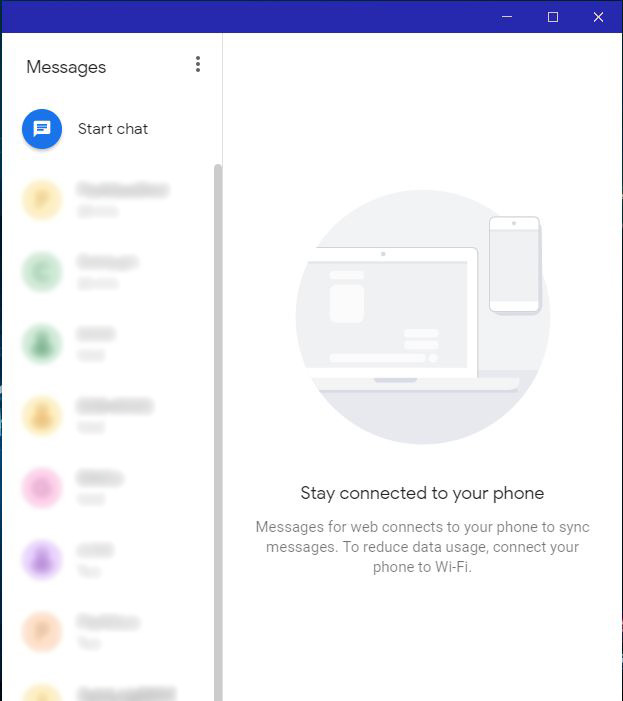
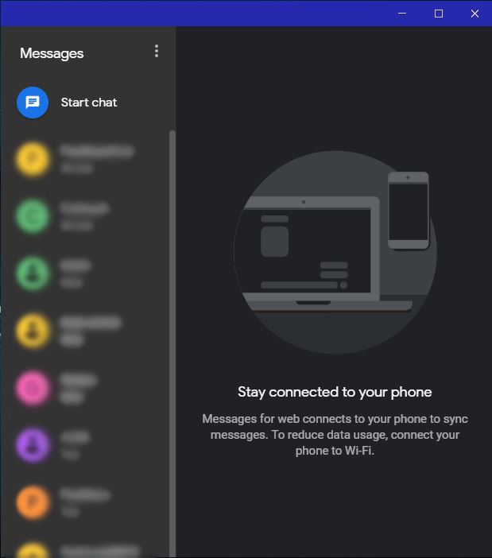

# Android Messages for Desktop
Light mode:  

 
Dark mode:  

## Notice
This app is only a container built w/ [Electron Framework](https://electronjs.org). The main application you see is owned by [Google LLC.](https://en.wikipedia.org/wiki/Google).

## Licensing
This work is licensed with [MIT](https://opensource.org/licenses/MIT).
